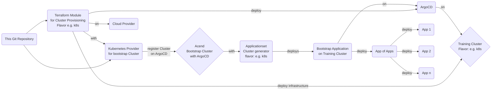

# acend training setup

This repository hosts everything related to the setup of acend's trainings, e.g., the Kubernetes cluster creation.

## Workflow



### Cluster provisioning using Terraform triggered in GitHub Actions workflows

- Terraform state stored in S3 bucket (on acend cluster)
- Each cluster flavor has its own Terraform module which is in a seperated repository.
- Terraform provider should be configured in root module (if possible) and passed to the module. Otherwise a simple removing of the module definition does not work as Terraform cannot remove the components within the module if provider definition is gone.

Example for the `k8s` flavor cluster:

```hcl
module "training-cluster" {

  source = "git::https://github.com/acend/terraform-k8s-cluster-lab.git//modules/training-cluster"

  providers = {
    restapi.hosttech_dns = restapi.hosttech_dns
    hcloud               = hcloud
    kubernetes.acend     = kubernetes.acend
  }

  # Variables for the cluster
}
```
  
### Register as cluster in the bootstrap Argocd (on acend cluster)

The Kubernetes Terraform provider `acend` is configured with a bootstrap Service Account that allows to create secrets in the `argocd` Namespace. It can also create `clustersecretstores` for the [external secret operator](https://external-secrets.io/).

Example for cluster registration with ArgoCD:

```hcl
resource "kubernetes_secret" "argocd-cluster" {
  provider = kubernetes.acend

  metadata {
    name      = var.cluster_name
    namespace = "argocd"

    labels = {
      "argocd.argoproj.io/secret-type" = "cluster"
      "flavor"                         = "k8s"
      "type"                           = "training"
    }
  }

  data = {
    name   = "${var.cluster_name}.${var.cluster_domain}"
    server = "https://api.${var.cluster_name}.${var.cluster_domain}:6443"
    config = jsonencode({
      tlsClientConfig = {
        caData   = local.kubeconfig.clusters[0].cluster.certificate-authority-data
        certData = local.kubeconfig.users[0].user.client-certificate-data
        keyData  = local.kubeconfig.users[0].user.client-key-data
      }
    })
  }

  type = "Opaque"
}
```

- The name of the secret is the cluster name. This can then be used in the bootstraping ApplicationSet to apply the correct overlay of the bootstraping Repository.
- The certificate in the secret needs to be able to deploy all the needed ArgoCD applications on the training cluster.
- The bootstrapping ApplicationSet is deployed from the main acend infrastructure. Here is an [example](https://github.com/acend/infrastructure/blob/main/deploy/training-cluster/base/argocd-bootstrap-k8s.yaml) for the `k8s` flavor:

```yaml
apiVersion: argoproj.io/v1alpha1
kind: ApplicationSet
metadata:
  name: argocd-bootstrap
  namespace: argocd
spec:
  generators:
  - clusters:
      selector:
        matchLabels:
          flavor: k8s
          type: training
  template:
    metadata:
      name: 'bootstrap-cluster-{{name}}'
    spec:
      project: default
      source:
        repoURL: https://github.com/acend/terraform-k8s-cluster-lab
        targetRevision: HEAD
        path: 'deploy/bootstrap/overlays/{{name}}'
      destination:
        server: '{{server}}'
        namespace: "argocd"
      syncPolicy:
        automated:
          prune: true
          selfHeal: true
```

- use your flavor specific repository for the Application definition.
- if needed, create overlays per cluster to differentiate between clusters. You have to maintain those overlays in your repository. The overlay shall use the cluster name

Here's an [example](https://github.com/acend/terraform-k8s-cluster-lab/tree/main/deploy/bootstrap) of the bootstraping app for the `k8s` flavored cluster.

Make sure to use the correct labels for your cluster:

- `argocd.argoproj.io/secret-type: cluster` has to be set for ArgoCD to use this as cluster conifguration
- `type: training` indicating this is a training cluster (tbd)
- `flavor` e.g. `k8s` depending on the cluster you created. The ApplicationSet on the bootstrap cluster and the [cluster generator](https://argocd-applicationset.readthedocs.io/en/stable/Generators-Cluster/) will target this label to deploy the correct bootstrap application.

### Cluster configuration

The `bootstrap` application (deployed from ArgoCD on the bootstraping cluster using the provider cluster configuration with the provisioned secret) shall deploy a [AppOfApps](https://argo-cd.readthedocs.io/en/stable/operator-manual/cluster-bootstrapping/#app-of-apps-pattern] Application on the training cluster.
Here's an [example](https://github.com/acend/terraform-k8s-cluster-lab/tree/main/deploy/apps) of the AppOfApps application for the `k8s` flavored cluster.

The AppOfApps Application shall then deploy all necessary components onto the training cluster:

- use Kustomize (when possible) with.
- For Helm Charts we also use [kustomize to generate YAML resources out of a Helm Chart](https://github.com/kubernetes-sigs/kustomize/blob/master/examples/chart.md)
- When Argo app is simple (e.g., one or a few files in a kustomize directory), use a centralized repository for all these apps (regardless of which cluster)
- When Argo app is complex, use a dedicated repository
